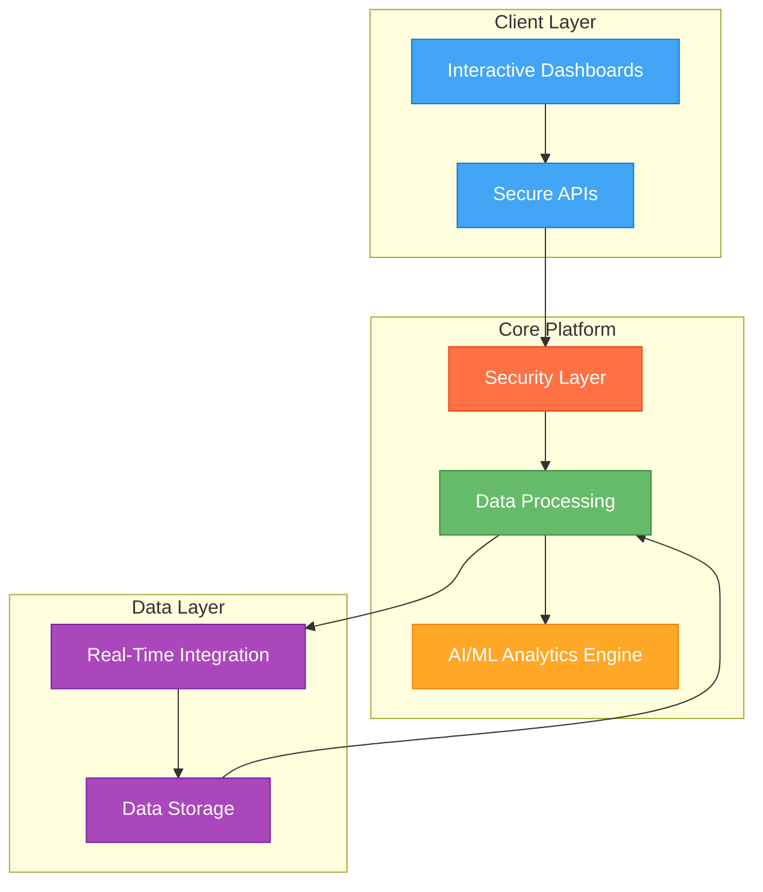
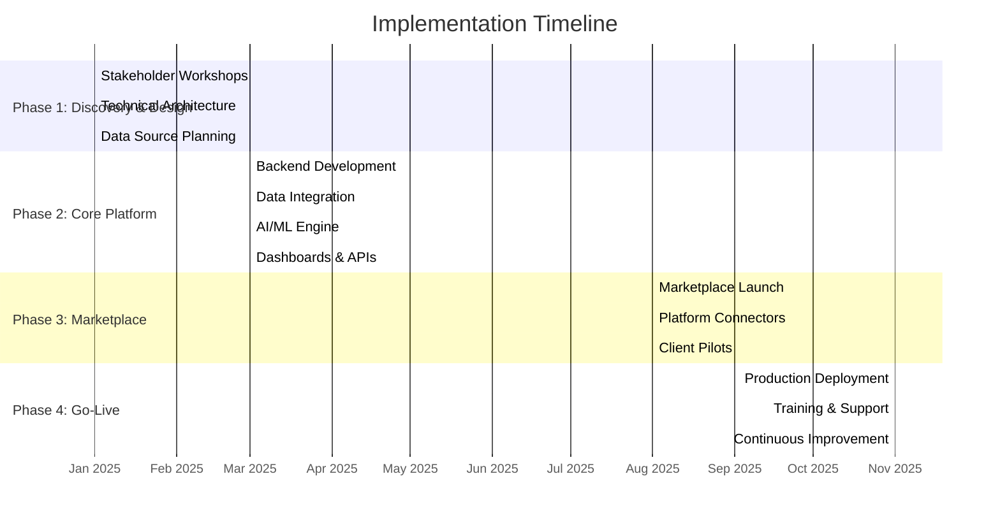
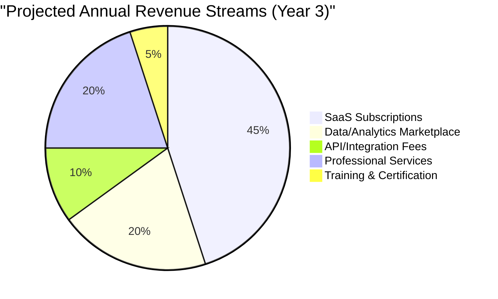
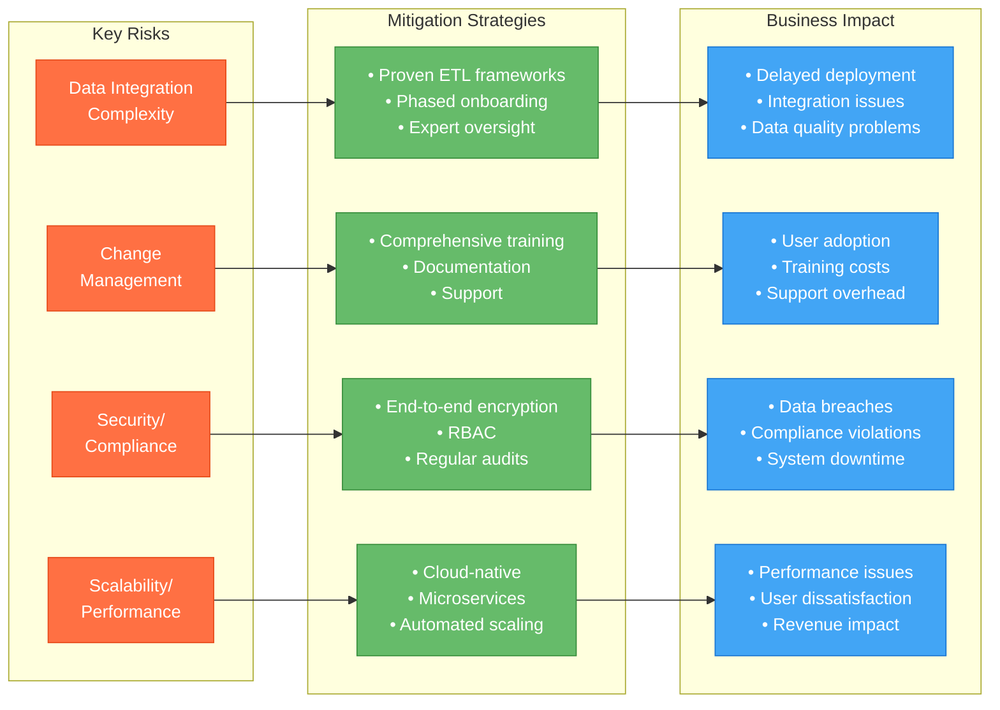

 
### Executive Summary

Woolpert GeoInsights™ represents a transformative SaaS platform that revolutionizes geospatial data analysis through cloud-native architecture, advanced AI/ML analytics, and seamless integration with professional services. The platform is designed to deliver actionable intelligence, optimize operations, and drive measurable ROI for clients.

### Market Analysis

The market opportunity is substantial and growing:

- Geospatial analytics market: Projected growth from $114.3B (2024) to $258B (2030)
- AI in geospatial analytics: Expected to reach $1.17B by 2033
- Smart city investments: Exceeding $700B by 2025
- Cloud adoption: 70% of enterprises prioritize cloud-native solutions

### Platform Architecture

The following diagram illustrates the high-level architecture of Woolpert GeoInsights™:

The diagram above illustrates the platform's architecture with color-coded components:

- Blue components represent the frontend layer, handling user interactions
- Green components show the core backend services
- Purple indicates data-related components
- Orange highlights security elements
- Yellow represents AI/ML capabilities

Data flows from client interactions through secure APIs, passing through the security layer before reaching the core processing components. The AI/ML engine and real-time integration services work together to process and analyze data, which is then stored and retrieved as needed.

### Implementation Timeline

The following Gantt chart shows the detailed implementation roadmap:

The Gantt chart above shows the detailed project timeline, where:

- Each section represents a major project phase
- Parallel activities within each phase are shown on separate lines
- The duration of each activity is indicated by the bar length
- All activities within a phase are synchronized to ensure proper project flow

### Revenue Streams

The following pie chart shows the projected revenue distribution:

The pie chart above shows the projected revenue distribution in Year 3, with values representing percentages of total revenue:

- SaaS Subscriptions: $6M-$12M (45%)
- Data/Analytics Marketplace: $2M-$4M (20%)
- Professional Services: $3M-$6M (20%)
- API/Integration Fees: $1M-$2M (10%)
- Training & Certification: $500K+ (5%)

These revenue streams combine to reach the projected Annual Recurring Revenue (ARR) of $10M-$20M in Year 3.

### Risk Management Framework

The following diagram illustrates the comprehensive risk management strategy:

The risk management framework diagram above illustrates the three key aspects of risk management:

- Red boxes show identified risks
- Green boxes outline mitigation strategies
- Blue boxes indicate potential business impacts

Each risk is directly connected to its corresponding mitigation strategy and potential impact, showing how Woolpert GeoInsights™ addresses each risk through specific countermeasures to minimize potential negative impacts on the business.

### Core Features

The platform includes several key features:

1. Cloud-Native Architecture:
          - .NET Core, Docker, Kubernetes
  - Scalable on AWS/GCP/Azure
  - Elastic and cost-effective

2. AI/ML Analytics Engine:
          - Predictive maintenance
  - Anomaly detection
  - Scenario modeling
  - Automated feature extraction

3. Real-Time Data Integration:
          - Satellite, LiDAR, IoT, BIM, and public GIS data
  - Medallion architecture for data quality
  - Unified, high-quality data

4. Interactive Dashboards:
          - Customizable 2D/3D maps
  - Time sliders
  - Scenario simulation
  - Built with React/Angular

5. Open, Secure APIs:
          - RESTful architecture
  - OAuth2/JWT-secured
  - OpenAPI-documented

6. Self-Service Marketplace:
          - Premium datasets
  - Analytics modules
  - Consulting services

7. DevOps & Security:
          - CI/CD pipeline
  - Automated testing
  - Monitoring
  - RBAC
  - GDPR/CCPA compliance

### Implementation Roadmap

The implementation is structured across four phases:

1. Phase 1: Discovery & Design (Months 1-2)
          - Stakeholder workshops
  - Technical architecture definition
  - Data source inventory

2. Phase 2: Core Platform Development (Months 3-7)
          - Cloud-native backend development
  - Data ingestion implementation
  - AI/ML engine development
  - Dashboard and API creation

3. Phase 3: Marketplace & Integration (Months 8-10)
          - Marketplace launch
  - Platform connectors development
  - Client pilots

4. Phase 4: Go-Live & Scale (Months 11-12)
          - Production deployment
  - Training and support rollout
  - Continuous improvement

### Financial Projections

The platform's financial projections include:

- Total Year 1 Investment: $2.95M
- Core Development: $1.5M
- Cloud Infrastructure: $400K
- Data Acquisition/ETL: $250K
- AI/ML Model Development: $350K
- QA/Testing: $150K
- Training/Documentation: $100K
- Marketing/Launch: $200K

### Use Cases & Impact

The platform delivers significant value across multiple sectors:

1. Smart City Asset Management:
          - 30-50% reduction in infrastructure downtime
  - Example: $5M annual savings for mid-sized city

2. Utilities & Energy:
          - 15-25% reduction in losses
  - Example: $2M+ annual savings for regional utility

3. Transportation & Logistics:
          - 20% improvement in on-time delivery
  - Example: $1M-$3M annual savings

4. Environmental Monitoring:
          - 40% faster reporting
  - Enhanced sustainability and compliance

### Competitive Differentiators

The platform offers several unique advantages:

1. Full-Stack Solution:
          - Only platform combining ingestion, AI analytics, visualization, and marketplace
  - Single extensible SaaS offering

2. Professional Services Integration:
          - Creates virtuous revenue cycle
  - High-margin consulting opportunities

3. Continuous Value Measurement:
          - Built-in GVM framework
  - Quantifiable ROI tracking

4. Future-Proof Technology:
          - Latest AI capabilities
  - Scalable data formats (Zarr, COG, GeoParquet)

### Risk Management & Mitigation

The platform addresses key risks through comprehensive strategies:

1. Data Integration:
          - Proven ETL frameworks
  - Phased onboarding
  - Expert oversight

2. Change Management:
          - Comprehensive training
  - Documentation
  - Support programs

3. Security:
          - End-to-end encryption
  - RBAC implementation
  - Regular audits

4. Scalability:
          - Cloud-native architecture
  - Microservices design
  - Automated scaling

### Next Steps

The proposal outlines three key next steps:

1. Schedule a Discovery Workshop
2. Approve Initial Budget
3. Form Project Team

The platform represents a bold, fact-based initiative that will not only meet current client needs but define the future of geospatial intelligence. With its comprehensive architecture, robust risk management framework, and clear implementation roadmap, Woolpert GeoInsights™ is well-positioned for success in the rapidly growing geospatial analytics market.
